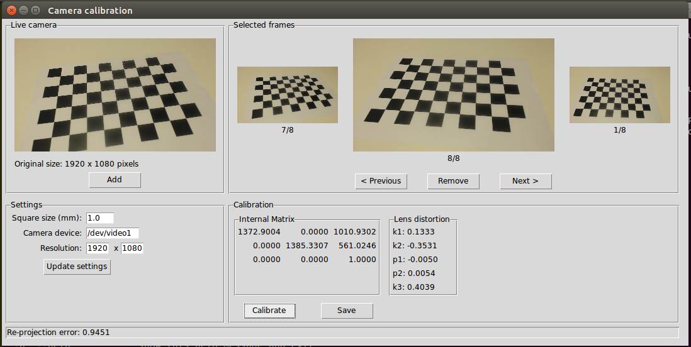
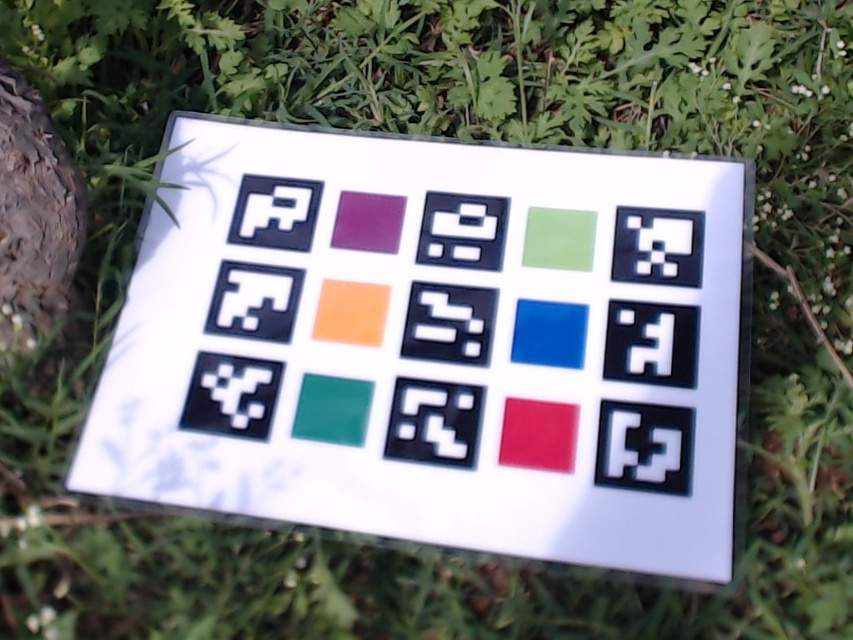
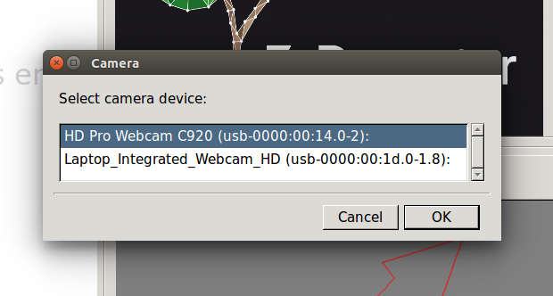
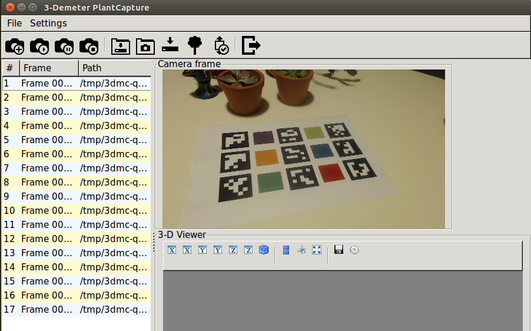
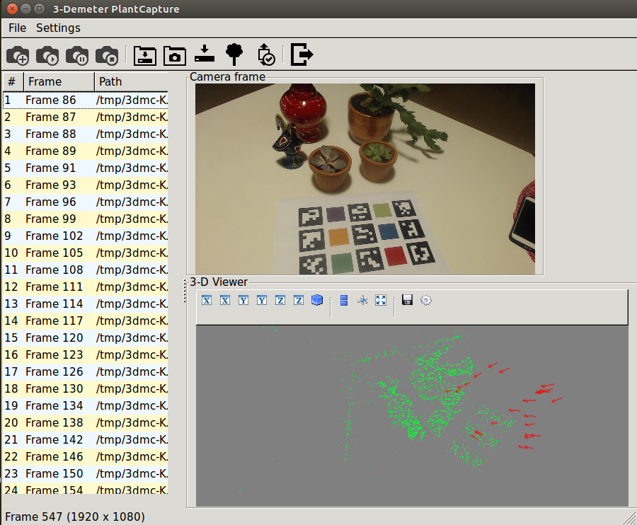
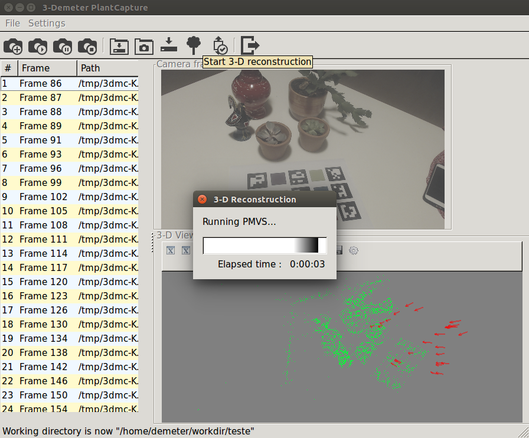
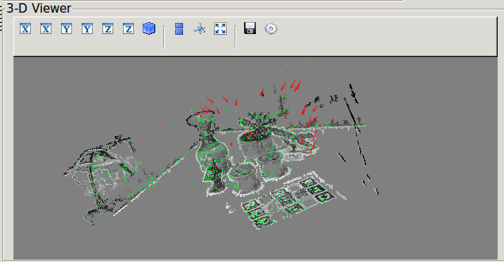
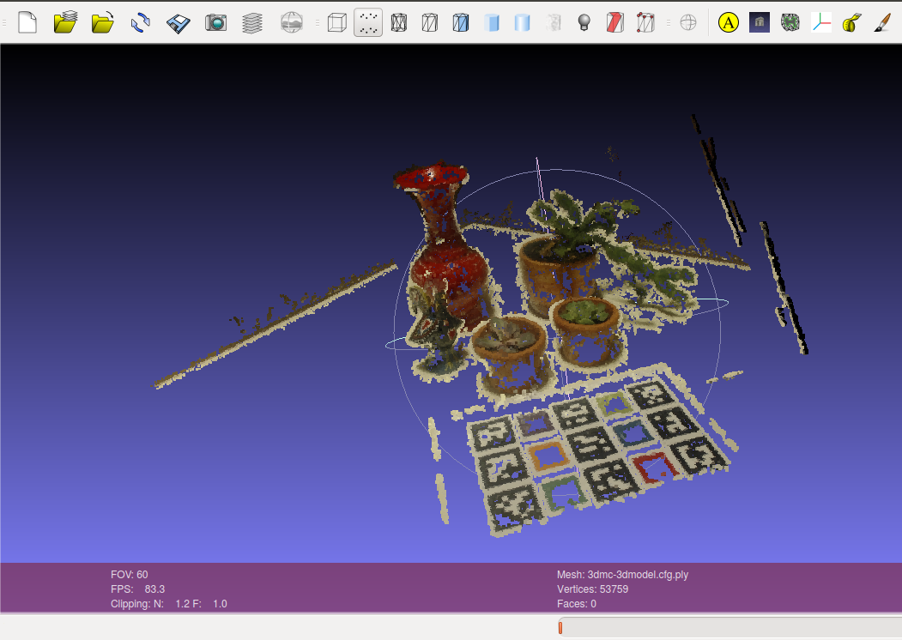

.. 3-Demeter Capture documentation master file, created by
   sphinx-quickstart on Wed Mar  7 14:18:17 2018.
   You can adapt this file completely to your liking, but it should at least
   contain the root `toctree` directive.

3-Demeter Capture Tutorial
==========================

*3-Demeter Capture* is an application for three-dimensional
reconstruction of objects from digital images. It allows an ordinary
camera and a computer to operate as *a simple 3-D scanner*. The
application assists the user on imaging and computing a cloud of 3-D
points, sampling the objects surfaces in three dimensions. Its purpose
within Embrapa is the 3-D reconstruction of plants for purposes of
automatic measurement in phenotyping and precision agriculture. 

You can see what the application is able to do in: 

Santos, T. T., Bassoi, L. H., Oldoni, H., &
Martins, R. L. (2017). *Automatic grape bunch detection in vineyards
based on affordable 3D phenotyping using a consumer
webcam*. In J. G. A. Barbedo, M. F. Moura, L. A. S. Romani, T. T. Santos, 
& D. P. Drucker (Eds.), Anais do XI Congresso Brasileiro de
Agroinformática (SBIAgro 2017) (pp. 89–98). Campinas: Unicamp. PDF_

.. _PDF: http://ainfo.cnptia.embrapa.br/digital/bitstream/item/169609/1/Automatic-grape-SBIAgro.pdf

Installation
------------

Running using Docker
~~~~~~~~~~~~~~~~~~~~

The easiest way to install and run 3-Demeter Capture is using our *Docker image*, `thsant/3dmcap`__. If you
have Docker running in a Ubuntu Linux host and a camera connected as ``/dev/video0``,  the following command
should install and run 3-Demeter Capture for you:

__ https://cloud.docker.com/swarm/thsant/repository/docker/thsant/3dmcap/general. 

::

   $ docker run -it --rm -e DISPLAY=$DISPLAY \
   -v /tmp/.X11-unix:/tmp/.X11-unix \
   --device /dev/video0 \
   -v $HOME/.3dmcap:/home/demeter/.3dmcap -v $HOME/workdir:/home/demeter/workdir \
   thsant/3dmcap capture.py

Note the command above assumes you have, in your home directory, a directory ``.3dmcap``, containing the configuration file, and a
``workdir`` directory for saving the results produced by the application in the Docker container.

If you have problems loading the graphical interface, try to execute

::
   
   $ xhost +local:root

before the docker run. After the execution, run

::
   
   $ xhost -local:root

to return the access controls.

Errors regarding NVIDIA drivers and OpenGL
~~~~~~~~~~~~~~~~~~~~~~~~~~~~~~~~~~~~~~~~~~

If you are facing crashes presenting the following error message:

::
   
   libGL error: No matching fbConfigs or visuals found
   libGL error: failed to load driver: swrast

then you are having issues regarding NVIDIA drivers and OpenGL from Docker. In this case, consider
`NVIDIA Docker`__ as a workaround.

__ https://github.com/NVIDIA/nvidia-docker

Dependencies
~~~~~~~~~~~~

The software depends on:

* Eigen 3;
* OpenCV with Python 2.7 support;
* Our `modified version of ORB_SLAM2`__. It includes DBoW2_  and g2o_ as the original ORB_SLAM2.

__ https://github.com/thsant/ORB_SLAM2
.. _DBoW2: https://github.com/dorian3d/DBoW2
.. _g2o: https://github.com/RainerKuemmerle/g2o

The Python components depend on:

* numpy
* scipy
* Pillow
* wxPython
* ObjectListView 
* traits
* traitsui
* mayavi
* PyYAML

3-Demeter Capture have beend tested in **Ubuntu 16.04** and **16.10**.

Building 3-Demeter Capture from sources
~~~~~~~~~~~~~~~~~~~~~~~~~~~~~~~~~~~~~~~

For users that prefer build the entire system in their own hosts, this
is the detailed building process. We assume ``/usr/local`` as the
install directory.

::

    INSTALL_PREFIX=/usr/local

Add Eigen (needed by OpenCV and g2o), build-essential and cmake:

::

    apt-get install -y build-essential libeigen3-dev cmake

Add OpenCV 3.4 dependencies:

::

    apt-get install -y git libgtk2.0-dev pkg-config libavcodec-dev \
    libavformat-dev libswscale-dev 
    apt-get install -y python-dev python-numpy libtbb2 libtbb-dev \
    libjpeg-dev libpng-dev libtiff-dev libjasper-dev libdc1394-22-dev

Get the `OpenCV 3.4.1 sources <https://opencv.org/releases.html>`__ and
extract the files to ``/usr/local/src``. Then build OpenCV:

::

    cd /usr/local/src/opencv-3.4.1 
    mkdir build 
    cd build 
    cmake -D CMAKE_BUILD_TYPE=Release -D CMAKE_INSTALL_PREFIX=$INSTALL_PREFIX .. 
    make -j4 
    make install 

Check if the Python module is OK:

::

    python -c 'import cv2; print cv2.__version__'

Install `Pangolin <https://github.com/stevenlovegrove/Pangolin.git>`__:

::

    apt-get install -y libglew-dev 
    cd /usr/local/src 
    git clone https://github.com/stevenlovegrove/Pangolin.git 
    cd Pangolin 
    mkdir build 
    cd build 
    cmake -D CMAKE_INSTALL_PREFIX=$INSTALL_PREFIX .. 
    make -j4 
    make install 

Install our modified ORB-SLAM2 version:

::

    apt-get install -y python-pip 
    pip install cython 
    cd /usr/local/src 
    git clone https://github.com/thsant/ORB_SLAM2.git 
    cd ORB_SLAM2 
    ./build.sh 
    cp lib/libORB_SLAM2.so /usr/local/lib 
    cp Thirdparty/DBoW2/lib/libDBoW2.so /usr/local/lib 
    cp Thirdparty/g2o/lib/libg2o.so /usr/local/lib 
    cp python/slam.so /usr/local/lib/python2.7/dist-packages/ 
    mkdir /usr/local/share/3dmcap 
    cp Vocabulary/ORBvoc.txt /usr/local/share/3dmcap/ 

Install PMVS. We recommend `pmoulon's version at
GitHub <https://github.com/pmoulon/CMVS-PMVS.git>`__:

::

    cd /usr/local/src 
    git clone https://github.com/pmoulon/CMVS-PMVS.git 
    cd CMVS-PMVS/program 
    mkdir build 
    cd build/ 
    cmake -D CMAKE_INSTALL_PREFIX=$INSTALL_PREFIX .. 
    make -j4 
    make install 

Add other 3-Demeter dependencies:

::

    apt-get install -y python-wxgtk3.0 python-vtk python-tk v4l-utils 

Finally, get 3-Demeter Capture code:

::

    cd /usr/local/src 
    git clone https://github.com/thsant/3dmcap.git 
    cd 3dmcap 
    pip install -r requirements.txt

Configure the environment:

::

    cd /usr/local/src/3dmcap 
    cp -r dmcap/ /usr/local/lib/python2.7/dist-packages 
    cp -r ./resources/* /usr/local/share/3dmcap 
    cp ./dmcap/camcal.py ./dmcap/capture.py /usr/local/bin  

Edit the **3dmcap.cfg** file and save it to your ``$HOME/.3dmcap``
directory. You can run **capture.py** to start 3-Demeter Capture.

Before starting image acquisition
---------------------------------

Before using 3-Demeter Capture for your image-based reconstruction, you must complete a few
preliminary steps:

  1. Pick a USB camera supported by Video4Linux.
  #. Disable camera autofocus functionality, if it is present.
  #. Calibrate the camera - you can use our `camcal.py` utility, included in 3-Demeter Capture distribution.
  #. Print the *scaling pattern*, if you wish that 3-Demeter to transform your point cloud to a desired reference (millimeters or inches, for example).
  #. Edit your *configuration file*.

In normal conditions, you should perform this procedure a single time if you intend to use the same camera several times.

Camera selection and calibration
~~~~~~~~~~~~~~~~~~~~~~~~~~~~~~~~

You should use an *USB high-definition camera* that is supported by Video4Linux. We have used the `Logitech HD Webcam c920`__, but
other devices should also work.

__ https://www.logitech.com/pt-br/product/hd-pro-webcam-c920 

After connecting your camera, you should *set the focus to infinity* and *turn autofocus off*. Changing focus turn the visual odometry
(the estimation of the camera location) a lot harder and the ORB-SLAM2 system (the visual odometry system used by 3-Demeter Capture)
will not work properly. You can use the ``v4l2-ctl`` tool accomplish this step at the Linux shell:

::
   
 $ v4l2-ctl -d /dev/video1 -c focus_auto=0
 $ v4l2-ctl -d /dev/video1 -c focus_absolute=0

The example above assumes your USB camera is connected as ``/dev/video1``. After that, you can use the utility ``camcal.py``, included in the 3-Demeter Capture software, to calibrate the camera. If 1920x1080 is the maximum resolution your camera is able to support, you should run ``camcal.py`` as the following:

::

   $ camcal.py --device /dev/video1 --fwidth 1920 --fheight 1080

or, if you are using the Docker container:

::

   $ docker run -it --rm -e DISPLAY=$DISPLAY \
   -v /tmp/.X11-unix:/tmp/.X11-unix \
   --device /dev/video1 -v /tmp:/home/demeter/workdir:rw \
   -v /home/thiago/.3dmcap:/home/demeter/.3dmcap \
   thsant/3dmcap camcal.py --device /dev/video1 --fwidth 1920 --fheight 1080

You should print the *chessboard pattern*  available in the `resources directory` and use the application to capture images of it from multiples views, as seen in the figure below.
   

Take a dozen images or more, then click the *Calibrate* button. Then, save the values to a file using the *Save* button for further usage.

Printing the scaling pattern
~~~~~~~~~~~~~~~~~~~~~~~~~~~~

The *scaling pattern* (available in the `resources directory`) is a sheet containing easily detectable markers presenting a known size. It should be printed and then *laminated*, forming a rigid planar tablet. 3-Demeter Capture will use this pattern to scale the point cloud to a proper measurement unit and also rotate the cloud to a standard orientation. If you put the scaling pattern in the ground, 3-Demeter can give you a oriented model where the Z axis points upward. 

The configuration file
~~~~~~~~~~~~~~~~~~~~~~

The configuration file provides essential information that 3-Demeter needs to work properly. The application looks for a configuration file in four different locations, using the first file it found in the following order:

  1. ``$HOME/.3dmcap/3dmcap.cfg``
  #. ``/etc/3dmcap.cfg``
  #. ``/usr/local/share/3dmcap/3dmcap.cfg``
  #. ``/usr/share/3dmcap/3dmcap.cfg``

We recommend users employ the first option, creating a ``.3dmcap`` directory in their home directories and placing a ``3dmcap.cfg`` file there. Below we show an example of a working ``3dmcap.cfg`` file:

::
   
   [camera]
   width=1920
   height=1080
   
   [general]
   resources_path=/usr/local/share/3dmcap
   ref_distance_mm=51.5
   
   [orbslam]
   config_fpath=/usr/local/share/3dmcap/Logitech-C920.yaml

The *camera* section provides the desired frame resolution. Remember digital cameras support several different resolutions and we recommend the bigger one able to work on 30Hz. The values for width and height **must be the same** used in the camera calibration step. The *general* section informs the path for the resources directory containing essential files for the application. Also in this section we have ``ref_distance_mm``, where you must provide the distance observed between two adjacent markers in your printed scaling pattern. Different printing configurations can create different patterns, so it is important you measure your final scaling pattern and set this value properly (see figure bellow).

.. figure:: ./figures/ref_dist.png
   :alt: The ref_distance_mm in the scaling pattern.

Finally, the *orbslam* section defines the path to the ORB-SLAM2 YAML file containing the camera calibration and other parameters needed by ORB-SLAM2 system. You should edit the camera calibration values, inserting the values you got using ``camcal.py``. Again, you will find an example in the resources directory.
	 
The image acquisition step
--------------------------

The application is started running ``capture.py``:

::

   $ capture.py

In Docker, you should use:

::
   
   docker run -it --rm \
   -e DISPLAY=$DISPLAY -v /tmp/.X11-unix:/tmp/.X11-unix \
   --device /dev/video0 --device /dev/video1 \
   -v /tmp:/home/demeter/workdir:rw \
   -v /home/thiago/.3dmcap:/home/demeter/.3dmcap
   thsant/3dmcap capture.py

Note the command line above uses:

* ``-e DISPLAY=$DISPLAY -v /tmp/.X11-unix:/tmp/.X11-unix`` to make the Docker container use the host X Windows system;
* ``--device /dev/video0 --device /dev/video1`` to make the cameras in the host available to the container;
* ``-v /tmp:/home/demeter/workdir:rw`` to map the host ``/tmp`` directory to the container ``$HOME/workdir``; and
* ``-v /home/thiago/.3dmcap:/home/demeter/.3dmcap`` to map the configuration directory in the host to the container.

You can change the host working directory or the host configuration directory to values that make more sense to your personal work flow. 
  
  .. figure:: ./figures/3dmcap_initscreen.png
   :alt: 3-Demeter Capture initial screen.

The first step is to use the *Settings* menu to select the camera to be employed:
	

  
Image acquisition is started pressing *Start new acquisition*. The software will spent a few seconds loading the *visual words* data and then the video frames will be displayed in the camera frame panel.

3-D map initialization
~~~~~~~~~~~~~~~~~~~~~~

A very important step is the *map initialization*, when the visual odometry system finds the first 3-D points in the scene by stereo vision. The further localization and mapping routines will rely in this initial 3-D map. To get a good initial map, consider these tips at the **very beginning** of the image acquisition:

* translates the camera slowly from left to right;
* look for textures and salient points, avoid homogeneous surfaces;
* avoid point the camera to a single plane, look for regions displaying objects in different planes.

Once the map is initialized, frames will start to appear in the list at the left of the application window. After that, you can move the camera with more freedom, employing rotations and approximations. However, continue to avoid very fast camera movements. In the case the tracking is lost, move the camera near to a previously visited location: ORB-SLAM will then perform *relocalization*. You can use the pause and resume buttons and the relocalization feature to take a break in long acquisitions steps. 

Don't forget to take a few frames of the scaling pattern. There is *no need* to make the pattern visible in every frame, a few frames are sufficient for further scaling and rotation.

Pressing *Finish acquistion* will stop the acquisition procedure. You can use the *Save capture files to...* button to save the data to your prefered path. 

  
Multiple view stereo with PMVS
------------------------------

The *Export files to the MVS subsystem* button will create the files needed by PMVS to perform the multiple view stereo step. After that, you can use *Start 3-D reconstruction* to start PMVS. You could also run PMVS directly from the shell in other time, avoiding the 3-Demeter interface or employing a PMVS instance running in a more powerful machine, just using the files exported by 3-Demeter.

PMVS will create a point cloud, stored as a PLY file in ``pmvs/models/3dmc-3dmodel.cfg.ply`` from the working directory. 
	 

  
Scaling
~~~~~~~

*Normalize scale and orientation* is optional and depends on good images of the scaling pattern. A successful scaling will produce a PLY file in ``pmvs/models/3dmc-3dmodel.norm.ply``.

Exploring your point cloud using Meshlab
~~~~~~~~~~~~~~~~~~~~~~~~~~~~~~~~~~~~~~~~

You can explore your point clouds in different applications. Meshlab_ is a great tool used to explore and manipulate clouds.

.. _Meshlab: http://www.meshlab.net

  
